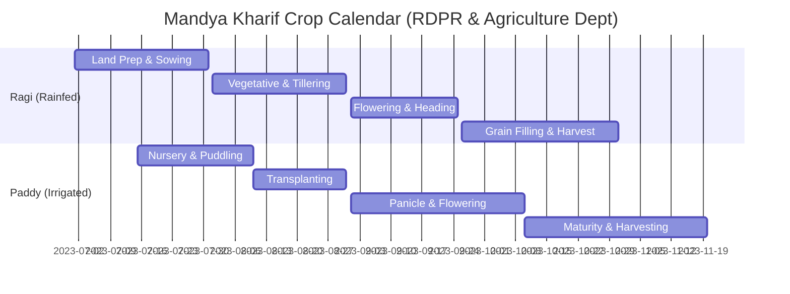

# Mandya District Agro-Climatic Baseline & Cropping Calendar

## 1. Geographic & Agro-Ecological Context
- **District:** Mandya, Karnataka, India
- **Geographic Area:** $4,961\text{ km}^2$
- **Administrative Divisions:** 7 Taluks, **235–258 Gram Panchayats (GPs)** (Average GP area: $\sim 19.2\text{ km}^2 \approx 1$ HR pixel of $5.5\text{ km} \times 5.5\text{ km}$)
- **Elevation:** $650\text{ m} - 900\text{ m}$ above MSL (Southern Dry Zone / Cauvery Basin)
- **Normal Monsoon Rainfall (JJAS):** $350\text{--}550\text{ mm}$ (Semi-arid, bimodal convective precipitation)

---

## 2. Dominant Crops: RDPR & KSNDMC Calendars

Mandya's agricultural landscape is dominated by two contrasting cropping systems:
1. **Ragi (Finger Millet - *Eleusine coracana*)**: Predominantly rainfed dryland crop.
2. **Paddy (Rice - *Oryza sativa*)**: Canal-irrigated (KRS Dam / Cauvery network) and tank-fed.

---

## 3. Crop Growth Stages & Rainfall Sensitivity Thresholds

### A. Ragi (*Finger Millet*) — Dryland Rainfed
| Growth Stage | Period | Water Requirement | Key Weather Sensitivity & Advisory Action |
|---|---|---|---|
| **Sowing & Emergence** | July – early Aug | $20\text{--}35\text{ mm}$ over 3 days | Requires moist seedbed. Postpone sowing if $<10\text{ mm}$ forecast. |
| **Vegetative & Tillering** | Aug | $3\text{--}4\text{ mm/day}$ | Relatively drought-hardy; weed management after light showers. |
| **Flowering & Panicle Initiation** | Sept | $5\text{--}6\text{ mm/day}$ | **Critical Moisture Stress Period:** Dry spell $>10$ days causes $30\text{--}40\%$ spikelet sterility. Supplemental protective irrigation triggered. |
| **Grain Hardening & Harvest** | Oct – Nov | Minimal | Vulnerable to unseasonal heavy rain ($>30\text{ mm/day}$); causes lodging and ear-head grain mold. |

### B. Paddy (*Rice*) — Canal / Tank Irrigated
| Growth Stage | Period | Water Requirement | Key Weather Sensitivity & Advisory Action |
|---|---|---|---|
| **Nursery & Transplanting** | July – Aug | Standing water ($2\text{--}5\text{ cm}$) | High water demand. Puddling coordinated with canal release and heavy rain forecasts. |
| **Active Tillering** | Aug – Sept | Standing water ($3\text{--}5\text{ cm}$) | Fertilizer top-dressing (Urea/Potash) requires dry spell of 24h to avoid nutrient runoff. |
| **Panicle Initiation & Heading** | Sept – early Oct | $6\text{--}8\text{ mm/day}$ | **Critical Yield Determination:** Water deficit leads to unfilled grains. Waterlogging $>15\text{ cm}$ damages young panicles. |
| **Ripening & Harvest** | Oct – Nov | Dry soil preferred | Field drainage required 10 days before harvest. Rain during maturity delays mechanical combine harvesting. |

---

## 4. The Need for Panchayat-Scale Downscaling (5.5 km vs 27 km)

- **Block-Level Deficiency ($0.25^\circ \approx 27\text{ km}$):**
  A single IMD cell covers $\approx 750\text{ km}^2$, encompassing entire taluks (e.g., Maddur or Malavalli) with 30–40 distinct Gram Panchayats. Summer and monsoon rains in Mandya are largely driven by **localized convective thunderstorm cells** ($3\text{--}8\text{ km}$ diameter). Under block forecasts, a thunderstorm in northern Malavalli averages out over the whole taluk, giving false advisories to farmers in the southern dry pocket.
- **Panchayat Scale ($0.05^\circ \approx 5.5\text{ km}$):**
  At $5.5\text{ km}$, 1 grid pixel corresponds to $\approx 30.1\text{ km}^2$ ($\approx 1.5\text{ GPs}$). This matches the natural spatial footprint of localized convection and allows the RDPR/Gram Panchayat agriculture officer to issue farm-level advisories (spraying vs fertilizing vs irrigation scheduling) tailored to village clusters.
