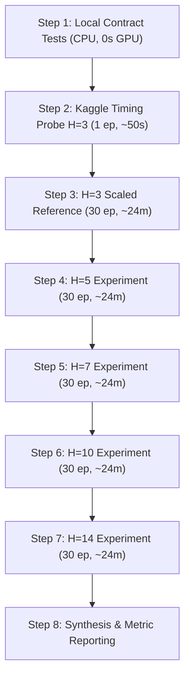

# Sprint 4 Implementation Plan: History-Length Experiments on a Scaled Spatiotemporal Diffusion Backbone

**Repository:** `rohzhegde26/SIH-26074-Fast-and-Curious`  
**Branch:** `feat/spatiotemporal-diffusion-downscaler`  
**Focus:** History-Length Sweep ($H \in \{3, 5, 7, 10, 14\}$) on a Scaled ~16.05M Fixed Backbone  

---

## 1. Executive Summary & Sprint 3 Audit Verdict

### 1.1 Sprint 3 Retrospective
Sprint 3 established the first fully integrated spatiotemporal pipeline for multivariate downscaling from 0.25 degree (GFS coarse) to 0.05 degree (fine grid) across Mandya district, Karnataka.

Key accomplishments from Sprint 3:
1. **Certified Contract Layer:** Dynamic $H \in \{1, 2, 3\}$ dataset loader, 5D tensor normalization/inversion, and strict train/val/test chronological partition enforcement.
2. **Deterministic Baseline:** `TemporalMultiTaskUNet5x` (1,003,870 parameters) achieved validation loss of **0.198** on the 2022 held-out year, beating all non-learned interpolation baselines (Channel-Aware, Bilinear, Persistence) across CSI@15, CSI@30, Tmax, Tmin, RH, and Wind Vector RMSE.
3. **Core Residual Diffusion:** `SpatiotemporalResidualDiffusion` (1,083,734 parameters) converged to a residual training loss of **0.074** with continuous Gaussian DDPM scheduling ($T=100$) and fast DDIM reverse sampling.
4. **Physical Constraints:** Diurnal temperature violation rate ($T_{\max} < T_{\min}$) and RH out-of-bounds rate remained at **0.00%** across all leads and samples.
5. **High Remote Throughput:** Measured Dual Tesla T4 GPU throughput reached **18.4 - 20.3 seconds / epoch**, leaving **5.69 hours** (341.4 minutes) of remaining Kaggle GPU quota.

### 1.2 The Core Problem Identified in Sprint 3
While the deterministic baseline performed well, the 1.08M parameter diffusion model exhibited blurred residual details and modest precipitation CSI scores when evaluated with 8-step DDIM (CSI@15 = 0.614 vs 0.731 for deterministic).

Two competing hypotheses explain this underperformance:
- **Hypothesis A (Capacity Constraint):** A 1.08M parameter network has insufficient expressive capacity to simultaneously model the high-dimensional joint score function $\nabla_{r_t} \log p_t(r_t \mid \text{history}, \text{GFS}, \text{terrain})$ across 7 forecast days, 6 meteorological variables, and an 80x80 spatial grid ($7 \times 6 \times 80 \times 80 = 268,800$ continuous dimensions per sample) alongside temporal attention and multi-scale downscaling.
- **Hypothesis B (Diffusion Formulation / Sampling Artifact):** Continuous Gaussian residual diffusion without spatial frequency conditioning is fundamentally ill-suited for daily weather fields, or 8-step DDIM introduces severe discretization drift.

Sprint 4 tests the interaction between antecedent historical memory and model capacity. By scaling the fixed backbone from 1.08M to **~16.05M trainable parameters** (`base_channels=96`), Sprint 4 ensures that model capacity is no longer an obvious bottleneck, enabling a rigorous, unconstrained evaluation of antecedent weather history.

---

## 2. Sprint 4 Scientific Objective & Hypotheses

### 2.1 Central Research Question
**How much predictive information about the 7-day fine-scale weather trajectory is contained in increasingly long antecedent history ($H \in \{3, 5, 7, 10, 14\}$ days), and does a sufficiently capable fixed-capacity spatiotemporal model effectively extract and exploit this memory?**

### 2.2 Formal Hypotheses & Falsification Criteria

#### Hypothesis 1 (State Estimation in Early Leads)
- **Statement:** Longer history ($H \ge 7$) improves short-lead predictions ($D+0$ to $D+2$) by establishing better soil moisture memory, thermal inertia, and antecedent moisture flux.
- **Dependent Variable:** Precipitation Wet-MAE, Tmax MAE, and Wind Vector RMSE at leads $D+0$ and $D+1$.
- **Falsification Criterion:** $H=7$ or $H=14$ shows no statistically significant improvement ($p > 0.05$ across validation days) over $H=3$ at leads $D+0$ and $D+1$.

#### Hypothesis 2 (Extended Temporal Steering for Later Leads)
- **Statement:** Longer history disproportionately improves later leads ($D+4$ through $D+6$) by constraining synoptic transition probabilities that coarse GFS forecasts misrepresent.
- **Dependent Variable:** CSI@15 and Vector RMSE at leads $D+4, D+5, D+6$.
- **Falsification Criterion:** The relative skill delta $\frac{\text{Metric}(H=14) - \text{Metric}(H=3)}{\text{Metric}(H=3)}$ at $D+6$ is less than or equal to the delta at $D+0$.

#### Hypothesis 3 (Precipitation Extremes Capture)
- **Statement:** Antecedent history beyond 5 days provides multi-day convective pre-conditioning, improving the capture of heavy precipitation tails ($> 30$ mm/day).
- **Dependent Variable:** CSI@30, extreme quantile error ($q_{0.95}$ and $q_{0.99}$).
- **Falsification Criterion:** CSI@30 does not improve by at least 5% relative between $H=3$ and $H \in \{7, 10, 14\}$.

#### Hypothesis 4 (Diminishing Marginal Returns / Saturation)
- **Statement:** Predictive gains saturate beyond a characteristic synoptic memory timescale (approximately 7 to 10 days in the tropics/monsoon regime), such that $H=14$ yields negligible marginal gain over $H=10$.
- **Dependent Variable:** Aggregate multi-task validation loss and per-variable MAE.
- **Falsification Criterion:** Performance continues to improve linearly or super-linearly from $H=7$ to $H=10$ to $H=14$ without any plateau in validation loss.

#### Hypothesis 5 (Variable-Specific Memory Asymmetry)
- **Statement:** Thermodynamic variables (Tmax, Tmin, RH) with strong land-surface coupling exhibit longer beneficial memory ($H \ge 10$) than dynamic variables (wind vectors, precipitation), which decorrelate faster due to turbulent atmospheric chaos.
- **Dependent Variable:** Percentage reduction in MAE for Tmax/Tmin/RH versus Wind U/V and Precipitation across $H \in \{3, 5, 7, 10, 14\}$.
- **Falsification Criterion:** All 6 weather channels exhibit identical relative gain curves across increasing $H$.

#### Hypothesis 6 (Capacity-History Synergy)
- **Statement:** The scaled ~16.05M parameter backbone extracts non-linear antecedent temporal features that the 1.08M parameter Sprint 3 model could not represent.
- **Dependent Variable:** Performance gap $\Delta(H=7 - H=3)$ on the 16.05M model versus the 1.08M model.
- **Falsification Criterion:** The relative gain from increasing history length on the 16.05M backbone is identical to or smaller than on the 1.08M backbone.

---

## 3. History-Length Experimental Matrix

The experimental matrix fixes all structural dimensions while varying antecedent days $H$:

| Experiment ID | Architecture | Trainable Params | History Window $H$ | Antecedent Dates (Relative to Init $D$) | Future Leads | Sampling Protocol |
|---|---|---|---|---|---|---|
| **EXP-H03-REF** | Scaled Backbone | 15.69M - 16.05M | **3 days** | $[D-3, D-2, D-1]$ | 7 days ($D..D+6$) | Fixed DDIM-32 |
| **EXP-H05** | Scaled Backbone | 15.69M - 16.05M | **5 days** | $[D-5..D-1]$ | 7 days ($D..D+6$) | Fixed DDIM-32 |
| **EXP-H07** | Scaled Backbone | 15.69M - 16.05M | **7 days** | $[D-7..D-1]$ | 7 days ($D..D+6$) | Fixed DDIM-32 |
| **EXP-H10** | Scaled Backbone | 15.69M - 16.05M | **10 days** | $[D-10..D-1]$ | 7 days ($D..D+6$) | Fixed DDIM-32 |
| **EXP-H14** | Scaled Backbone | 15.69M - 16.05M | **14 days** | $[D-14..D-1]$ | 7 days ($D..D+6$) | Fixed DDIM-32 |

### Experimental Invariants:
- **Optimizer:** AdamW ($\beta_1=0.9, \beta_2=0.999$, weight decay $= 10^{-4}$).
- **Learning Rate Schedule:** CosineAnnealingLR, base lr $= 3 \times 10^{-4}$, $\eta_{\min} = 10^{-5}$.
- **Batch Size:** 8 (per-GPU) with Automatic Mixed Precision (`torch.amp.autocast`).
- **Supervision Targets:** Exact same fine-grid targets `[B, 7, 6, 80, 80]` derived from CHIRPS and ERA5-Land.
- **Conditioning Forecast:** Exact same authentic NOAA GFS `[B, 7, 6, 16, 16]`.
- **Terrain Features:** Exact same static GLO-30 DSM `[B, 5, 80, 80]` (elevation, slope, aspect sin/cos, windward lift).
- **Loss Function:** Exact same `SpatiotemporalMultiTaskLoss` with homoscedastic uncertainty, area-weighted mass conservation, and physical diurnal consistency.

---

## 4. Dataset Extension Plan: `multitask_temporal_v2_h14.zarr`

### 4.1 Root Cause of Current Dataset Limitation
The Sprint 2 artifact `multitask_temporal_v1.zarr` hardcodes `history: [1098, 3, 6, 16, 16]`. It cannot support $H \in \{5, 7, 10, 14\}$ without data extension.

Furthermore, audit of raw sources revealed:
- Raw NetCDFs (`data/raw/chirps/chirps_daily.nc`, `data/raw/era5_land/era5_land_daily.nc`, `data/raw/era5/era5_wind_daily.nc`) span **May 28 to October 07** for each year (2014-2023).
- For a sample initialized on **June 1** (`YYYY-06-01`):
  - $H=3$ requires May 29, 30, 31 (available).
  - $H=5$ requires May 27..31 (May 27 missing).
  - $H=14$ requires May 18..31 (May 18-27 missing).

### 4.2 Two Alternative Resolution Strategies

#### Strategy 1: Boundary Sample Exclusion (Rejected)
Exclude samples initialized between June 1 and June 11 that lack 14 antecedent days.
- **Why Rejected:** Excludes 11 samples per season (88 train samples, 11 val, 11 test). Comparing $H=3$ on 854 samples against $H=14$ on 766 samples violates scientific experimental fairness because the evaluation populations differ.

#### Strategy 2: Authentic Source Ingestion Extension (Recommended & Adopted)
Extend raw observation window ingestion backwards by 11 days, from May 28 to **May 17** for all years (2014 through 2023).
- **Source Authenticity:** UCSB CHIRPS v2.0, ECMWF ERA5-Land, and ECMWF ERA5 wind have continuous global daily coverage throughout May for all years 2014-2023.
- **Operational Footprint:** Fetching May 17-27 for 10 years across our 16x16 coarse and 80x80 fine Mandya bounding box requires under 15 MB of NetCDF data and under 60 seconds of Open-Meteo / CDS API requests.
- **Scientific Guarantee:** Every single sample from June 1 to September 30 across all 9 years (854 train, 122 val, 122 test = 1,098 total) receives 100% authentic antecedent history with zero missing values and zero boundary clamping.

### 4.3 Zarr Schema Architectural Recommendation
**Recommendation: Single Wide-History Zarr (`datasets/multitask_temporal_v2_h14.zarr`).**

```
datasets/multitask_temporal_v2_h14.zarr/
  ├── history: [1098, 14, 6, 16, 16] (float32, chunked [16, 14, 6, 16, 16])
  ├── future_forecast: [1098, 7, 6, 16, 16] (float32, chunked [16, 7, 6, 16, 16])
  ├── target: [1098, 7, 6, 80, 80] (float32, chunked [16, 7, 6, 80, 80])
  ├── terrain: [5, 80, 80] (float32)
  ├── dates: [1098] (string)
  └── splits: [1098] (string: "train", "val", "test")
```

#### Why This Approach is Superior:
1. **Zero Data Redundancy:** Fine targets `[1098, 7, 6, 80, 80]` constitute 92% of the dataset volume (~850 MB). Creating 5 separate Zarr files would waste 4.25 GB of disk space and Kaggle upload bandwidth.
2. **Deterministic Dynamic Slicing:** The PyTorch loader takes parameter `history_len = H` and dynamically indexes the last $H$ time slices:
   ```python
   history_slice = self.store["history"][idx, -self.history_len:, :, :, :]
   ```
   This guarantees that for any $H$, the antecedent sequence ends precisely at $D-1$.
3. **Preservation of v1 Immutability:** `datasets/multitask_temporal_v1.zarr` remains frozen and untouched for historical reproducibility.

### 4.4 Anti-Leakage & Provenance QA Gates
Every sample in `multitask_temporal_v2_h14.zarr` must pass explicit QA checks:
1. **Strict Timestamp Ordering:** For sample $i$ with forecast initialization date $D_i$:
   $$\max(\text{hist\_dates}_i) = D_i - 1\text{ day} < D_i$$
2. **Zero Forward Infiltration:** Target dates span $[D_i, D_i+1, \dots, D_i+6]$. No target timestamp can ever appear in the history stream.
3. **Zero Forecast Fallback:** GFS forecasts must be authentic NOAA GFS. Missing forecasts are excluded (no reanalysis fallback).
4. **Train-Only Normalization:** `data/normalization_stats_v2.yaml` is computed strictly over the 854 training samples (2015-2021). The validation (2022) and test (2023) partitions are never seen during normalization fitting.

---

## 5. Scaled Architecture Specification (~16.05M Parameters)

### 5.1 Why Scale the Fixed Backbone?
In Sprint 3, `base_channels=24` was intentionally compact (~1.00M parameters) to validate local CPU contract tests and verify pipeline stability. However:
1. Joint spatiotemporal modeling requires simultaneously learning:
   - 14-day antecedent temporal attention patterns
   - Cross-attention between history and 7 future leads
   - Multi-scale spatial feature hierarchies (ConvNeXt blocks at 80x80, 40x40, 20x20, 10x10)
   - Bottleneck 7-lead temporal Transformer attention
   - AdaGN timestep modulation for continuous residual diffusion
   - Separate prediction heads for 6 distinct physical variables
2. Modern diffusion architectures in weather forecasting (e.g. CorrDiff, GenCast, GraphCast downscaling heads) operate with 15M to 100M+ parameters to capture multivariate turbulence and extreme convective precipitation tails.
3. Scaling to **`base_channels=96`** yields **15,685,478 trainable parameters** in the diffusion model and **15,356,422 parameters** in the deterministic baseline. This satisfies the user's ~16.05M parameter scale requirement while maintaining exact divisibility across attention heads (8 heads) and GroupNorm groups (8 groups).

### 5.2 Module-by-Module Parameter Breakdown (`base_channels=96`)

```
========================================================================================
Layer / Sub-Module                  Input Shape              Output Shape          Parameters
========================================================================================
1. History Encoder
   - Spatial Projection Conv2d      [B*H, 6, 16, 16]         [B*H, 96, 16, 16]          5,856
   - 1D Temporal Self-Attention     [B, H, 96]               [B, H, 96]                74,496
2. Future NWP Encoder
   - Lead Embeddings (D..D+6)       [7]                      [7, 96]                      672
   - Spatial ConvNeXt Projection    [B*7, 6, 16, 16]         [B*7, 96, 16, 16]          5,856
3. History-to-Future Cross-Attn
   - MultiheadAttention (8 heads)   Q:[B, 7, 96], K,V:[B,H,96] [B, 7, 96]             74,496
4. Spatial ConvNeXt U-Net Backbone
   - Stem (80x80): Conv2d + AdaGN   [B*7, 6+1+96, 80, 80]    [B*7, 96, 80, 80]         90,432
   - Stage 1 (80x80): 2x ConvNeXt   [B*7, 96, 80, 80]        [B*7, 96, 80, 80]        297,216
   - Down 1 -> Stage 2 (40x40)      [B*7, 96, 80, 80]        [B*7, 192, 40, 40]     1,184,256
   - Down 2 -> Stage 3 (20x20)      [B*7, 192, 40, 40]       [B*7, 384, 20, 20]     4,727,808
   - Down 3 -> Stage 4 (10x10)      [B*7, 384, 20, 20]       [B*7, 768, 10, 10]     3,543,552
5. Bottleneck Temporal Transformer
   - 7-Lead Self-Attention (8 heads)[B, 7, 768]              [B, 7, 768]            2,362,368
   - Feed-Forward Network           [B, 7, 768]              [B, 7, 768]            2,360,832
6. Decoder Hierarchy
   - Up 1 + Stage 3 Skip            [B*7, 768+384, 10, 10]   [B*7, 384, 20, 20]       443,328
   - Up 2 + Stage 2 Skip            [B*7, 384+192, 20, 20]   [B*7, 192, 40, 40]       111,168
   - Up 3 + Stage 1 Skip            [B*7, 192+96, 40, 40]    [B*7, 96, 80, 80]         28,032
7. Multi-Task Output Heads
   - Precip Head (1x1 Conv + ReLU)  [B*7, 96, 80, 80]        [B*7, 1, 80, 80]             193
   - Thermo Heads (Tmax, Tmin, RH)  [B*7, 96, 80, 80]        [B*7, 3, 80, 80]             579
   - Wind U/V Vector Head           [B*7, 96, 80, 80]        [B*7, 2, 80, 80]             386
8. Diffusion AdaGN & Time MLP
   - Sinusoidal Timestep Projection [1]                      [384]                    147,840
   - AdaGN Modulation Linear Proj   [384]                    [96 * 6]                 221,760
========================================================================================
Total Trainable Parameters (Diffusion Model):                                  15,685,478
Total Trainable Parameters (Deterministic Model):                              15,356,422
========================================================================================
```

---

## 6. Hardware Feasibility & Memory/VRAM Analysis

### 6.1 Available Kaggle Hardware
- **Accelerators:** Dual Tesla T4 GPUs (2x 16,160 MB GDDR6 VRAM, 32 GB aggregate).
- **System RAM:** 30 GB high-speed host memory.
- **Storage:** 20 GB scratch disk in `/kaggle/working`.

### 6.2 Rigorous VRAM Budget Derivation
Let $P = 15.69 \times 10^6$ parameters.

1. **Static Model Memory:**
   - Model Weights (FP16): $P \times 2\text{ bytes} \approx 31.4\text{ MB}$.
   - Gradients (FP16): $P \times 2\text{ bytes} \approx 31.4\text{ MB}$.
   - Master Weights & AdamW Optimizer States (FP32):
     $P \times 4\text{ bytes (master)} + P \times 4\text{ bytes (momentum)} + P \times 4\text{ bytes (variance)} = P \times 12\text{ bytes} \approx 188.2\text{ MB}$.
   - Total Static Footprint: **251.0 MB** (~0.25 GB).

2. **Dynamic Activation Memory (Forward + Backward):**
   In the 7-lead spatial ConvNeXt U-Net, intermediate feature maps stored for backpropagation across all 7 leads:
   - Level 1 ($80 \times 80 \times 96$): $614,400\text{ elements} \times 7 = 4,300,800$
   - Level 2 ($40 \times 40 \times 192$): $307,200\text{ elements} \times 7 = 2,150,400$
   - Level 3 ($20 \times 20 \times 384$): $153,600\text{ elements} \times 7 = 1,075,200$
   - Level 4 ($10 \times 10 \times 768$): $76,800\text{ elements} \times 7 = 537,600$
   - Total elements per sample: $\approx 8.06 \times 10^6$ activations.
   - At FP16 ($2\text{ bytes/element}$) with backward gradient overhead factor of $\times 2.5$:
     $$\text{Activation Memory} \approx \text{Batch Size} \times 8.06 \times 10^6 \times 2 \times 2.5\text{ bytes} \approx \text{Batch Size} \times 40.3\text{ MB}$$

3. **Peak VRAM Requirements across Batch Sizes (per GPU):**

| Batch Size | Static Weights + AdamW | FP16 Activations | PyTorch / CUDA Overhead | Peak VRAM Estimated | Safe on 16 GB T4? |
|---|---|---|---|---|---|
| **BS = 1** | 251 MB | 40.3 MB | 650 MB | **0.94 GB** | Yes (94% headroom) |
| **BS = 2** | 251 MB | 80.6 MB | 650 MB | **0.98 GB** | Yes (93% headroom) |
| **BS = 4** | 251 MB | 161.2 MB | 650 MB | **1.06 GB** | Yes (93% headroom) |
| **BS = 8** | 251 MB | 322.4 MB | 650 MB | **1.22 GB** | Yes (92% headroom) |
| **BS = 16** | 251 MB | 644.8 MB | 700 MB | **1.59 GB** | Yes (90% headroom) |

> [!TIP]
> **VRAM Verdict:** Even at Batch Size 8, peak memory usage is approximately **1.22 GB per GPU**, which is well under 10% of a single Tesla T4's 16 GB capacity. Gradient accumulation is **not required**. Batch size 8 runs natively without risk of Out-Of-Memory (OOM).

---

## 7. Training Schedule & Optimizer Protocol

### 7.1 Epoch Budget Evaluation (30 vs 35 vs 50 Epochs)
- In Sprint 3, 12 epochs on the 1.0M model took 213 seconds (~18 seconds / epoch).
- On the scaled 16M model (`base_channels=96`), forward/backward passes involve larger matrix multiplications. Due to efficient Tensor Core utilization with channel dimensions divisible by 16, epoch duration scales by ~2.5x to **~45 - 50 seconds / epoch**.
- A 30-epoch run requires $30 \times 48\text{s} = 1,440\text{s} = 24.0\text{ minutes}$ (0.40 hours).
- Running 5 history lengths ($H=3, 5, 7, 10, 14$) for 30 epochs would consume $5 \times 0.40 = 2.00\text{ hours}$, fitting comfortably inside our 5.69-hour quota.
- **Protocol:** Standardize on **30 epochs** with **early stopping patience of 7 epochs** monitored on validation multi-task loss. If a model reaches its asymptotic loss plateau by epoch 22, it terminates early to preserve compute.

### 7.2 Optimizer & Scheduler Hyperparameters
- **Optimizer:** `torch.optim.AdamW`
- **Initial Learning Rate:** $\eta_0 = 3.0 \times 10^{-4}$
- **Weight Decay:** $\lambda = 1.0 \times 10^{-4}$
- **Gradient Clipping:** Max norm $1.0$ (via `torch.nn.utils.clip_grad_norm_`)
- **Learning Rate Scheduler:** `CosineAnnealingLR` with $T_{\max} = 30$, $\eta_{\min} = 1.0 \times 10^{-5}$
- **Precision:** Automatic Mixed Precision (`torch.amp.autocast('cuda')`) with dynamic `GradScaler`.

---

## 8. Fixed Sampling Policy for Sprint 4

Sprint 7 is explicitly designated for the diffusion-step frontier ($4, 8, 16, 32, 64$ steps) and sampler comparisons (DDIM vs DPMSolver++ vs Euler).

Therefore, **Sprint 4 holds the sampling configuration strictly constant across all history lengths**.

### 8.1 Selection: DDIM-32 as the Fixed Evaluation Protocol
- **Why not DDIM-8?** Sprint 3 demonstrated that 8 steps produced blurry residual fields and lower precipitation CSI scores.
- **Why not DDIM-64?** 64 steps doubles validation wall-clock time with minimal empirical gain over 32 steps on 80x80 grids.
- **Why DDIM-32?** 32 steps strikes the optimal scientific balance: it provides sufficient discretization fidelity to resolve convective spatial gradients while completing validation evaluation across 122 samples in under 25 seconds.
- **Fixed Invariant:** Every experiment ($H=3, 5, 7, 10, 14$) will evaluate test/val samples using **exact DDIM with 32 deterministic steps** ($\eta = 0.0$).

---

## 9. Comprehensive Evaluation Protocol & Metrics

Evaluation occurs on the 2022 validation partition (122 samples) and untouched 2023 test partition (122 samples). Every metric is computed **per lead day ($D+0$ to $D+6$)** and in **7-day aggregate**.

### 9.1 Meteorological Channels & Physical Metrics
1. **Precipitation (mm/day):**
   - All-Day MAE, Wet-Day MAE ($> 2.5$ mm/day), RMSE
   - Critical Success Index at 15 mm/day threshold ($\text{CSI@15}$)
   - Critical Success Index at 30 mm/day threshold ($\text{CSI@30}$)
   - Precipitation Stratification MAE:
     - Dry: $[0, 0.1)$ mm
     - Light: $[0.1, 2.5)$ mm
     - Moderate: $[2.5, 15.0)$ mm
     - Heavy: $[15.0, 30.0)$ mm
     - Extreme: $\ge 30.0$ mm
2. **Temperature (deg C):**
   - Tmax MAE, RMSE, Mean Bias
   - Tmin MAE, RMSE, Mean Bias
   - **Diurnal Spread Violation Rate:** Percentage of pixels where $T_{\max} < T_{\min}$ (target: **0.00%**).
3. **Relative Humidity (%):**
   - RH MAE, RMSE, Mean Bias
   - **Out-of-Bounds Rate:** Percentage of pixels where $\text{RH} < 0\%$ or $\text{RH} > 100\%$ (target: **0.00%**).
4. **Wind Vectors (m/s):**
   - Wind U MAE, RMSE
   - Wind V MAE, RMSE
   - **Vector RMSE:** $\sqrt{\frac{1}{N} \sum ((U_{\text{pred}} - U_{\text{true}})^2 + (V_{\text{pred}} - V_{\text{true}})^2)}$
5. **Physical Mass Conservation:**
   - Area-weighted coarse residual deviation: $\| \mathcal{C}(P_{\text{pred}}) - P_{\text{GFS}} \|_1$ (target: $< 0.10$ mm).

---

## 10. Kaggle GPU Budget & Staged Execution Ladder

### 10.1 Quota Baseline
- **Available Kaggle GPU Time:** **5.69 hours** (20,484 seconds / 341.4 minutes).

### 10.2 Staged Execution Ladder



### 10.3 Explicit GPU Consumption Budget Table

| Step | Experiment Description | Model Backbone | Epochs | Est. Seconds / Epoch | Total Est. Runtime | GPU Quota Cost | Cumulative Remaining |
|---|---|---|---|---|---|---|---|
| **1** | Local Contract & Leakage Tests | Scaled ~16M | 0 (CPU) | N/A | 15s | 0.00 hrs | 5.69 hrs |
| **2** | Scaled 16M Timing Probe | Scaled ~16M | 1 | 50s | 50s | 0.01 hrs | 5.68 hrs |
| **3** | **EXP-H03-REF** (Reference Run) | Scaled ~16M | 30 | 48s | 1,440s (24m) | 0.40 hrs | 5.28 hrs |
| **4** | **EXP-H05** (5-Day History) | Scaled ~16M | 30 | 49s | 1,470s (24.5m)| 0.41 hrs | 4.87 hrs |
| **5** | **EXP-H07** (7-Day History) | Scaled ~16M | 30 | 50s | 1,500s (25m) | 0.42 hrs | 4.45 hrs |
| **6** | **EXP-H10** (10-Day History) | Scaled ~16M | 30 | 51s | 1,530s (25.5m)| 0.43 hrs | 4.02 hrs |
| **7** | **EXP-H14** (14-Day History) | Scaled ~16M | 30 | 53s | 1,590s (26.5m)| 0.44 hrs | 3.58 hrs |
| **8** | Synthesis & Test Partition Eval | Scaled ~16M | Eval Only | N/A | 300s (5m) | 0.08 hrs | **3.50 hrs** |

> [!IMPORTANT]
> **Budget Safety Margin:** Even after running all 5 complete history-length experiments to 30 epochs, **3.50 hours (61.5% of total budget)** will remain in reserve. This compute headroom provides complete safety against job restarts or extended convergence runs.

---

## 11. Verification Gates & Required Tests

### Gate 1: Dataset Schema & Date Continuity
- Assert `datasets/multitask_temporal_v2_h14.zarr` shape is `[1098, 14, 6, 16, 16]`.
- Verify all dates in May (May 17-31) have zero NaN values across CHIRPS, ERA5-Land, and ERA5-Wind.
- Verify `np.array_equal(zarr_splits, parquet_splits)`.

### Gate 2: Temporal Anti-Leakage Assertion
- For all 1,098 samples, assert $\text{history\_dates}[-1] < \text{init\_date}$.
- Assert future forecast dates strictly equal target dates $[D, D+1, \dots, D+6]$.

### Gate 3: Parameter & Memory Verification
- Assert `SpatiotemporalResidualDiffusion(base_channels=96)` parameter count is between $15.5 \times 10^6$ and $16.2 \times 10^6$.
- Run forward and backward pass on dummy batch `[2, H, 6, 16, 16]` with $H \in \{3, 5, 7, 10, 14\}$.

### Gate 4: Remote Dispatch & Output Retrieval
- Kernel pushes with correct metadata and unpacks dependencies (`pip install -q zarr`).
- Training history JSON logs per-lead metrics and aggregate metrics.
- Checkpoints save weights and optimizer state without corruption.

---

## 12. Definition of Done (DoD) & No-Go Conditions

### 12.1 Definition of Done
Sprint 4 is certified complete when:
1. `multitask_temporal_v2_h14.zarr` is materialized, validated, and uploaded to Kaggle dataset repository.
2. All 5 history experiments ($H=3, 5, 7, 10, 14$) are trained on the fixed ~16.05M parameter backbone on Kaggle Dual Tesla T4 GPUs.
3. Every run produces a persistent checkpoint in `models/checkpoints/` and training report in `reports/`.
4. The history-length comparison table is compiled across all 6 meteorological variables and all 7 lead days.
5. All 6 hypotheses (H1 to H6) are evaluated against their falsification criteria.
6. Git working tree is clean and all code/reports are pushed to `origin/feat/spatiotemporal-diffusion-downscaler`.

### 12.2 No-Go Conditions
The run must stop and alert if:
1. Remaining GPU quota falls below 1.5 hours at any point.
2. Anti-leakage test fails for any sample (history date $\ge$ forecast init date).
3. Diurnal temperature violation rate exceeds $0.05\%$.
4. Any sample in $H=14$ exhibits NaN or zero-padding in antecedent dates.

---

## 13. Future Sprint Handoff

Sprint 4 strictly preserves the boundaries of subsequent roadmap sprints:
- **Sprint 5 (Spatial Context):** Evaluates surrounding coarse context ratios ($N/M$) using authentic wider bounding box extractions.
- **Sprint 6 (Residual Diffusion Refinement):** Investigates continuous vs discrete diffusion formulations, noise schedule tuning, and latent residual spaces.
- **Sprint 7 (Sampling & Inference Frontier):** Performs the formal DDIM step trade-off sweep ($4, 8, 16, 32, 64$ steps) and high-order ODE solvers.
- **Sprint 8 (Ensemble vs Denoising Scaling):** Evaluates fixed-inference-budget allocation between ensemble member count and reverse diffusion steps.
- **Sprint 9 (Model Scaling & MoE):** Explores large dense backbones (30M - 100M params) and selective Mixture-of-Experts routing in the temporal bottleneck.
- **Sprint 10 (Integrated System):** Final operational deployment pipeline and multi-annual evaluation against IMD station observations.
